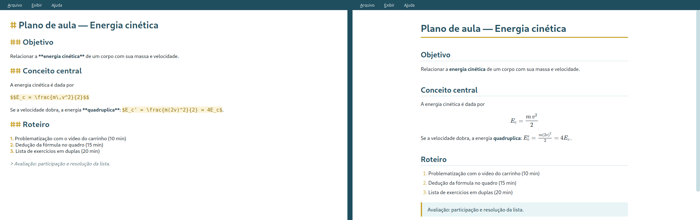
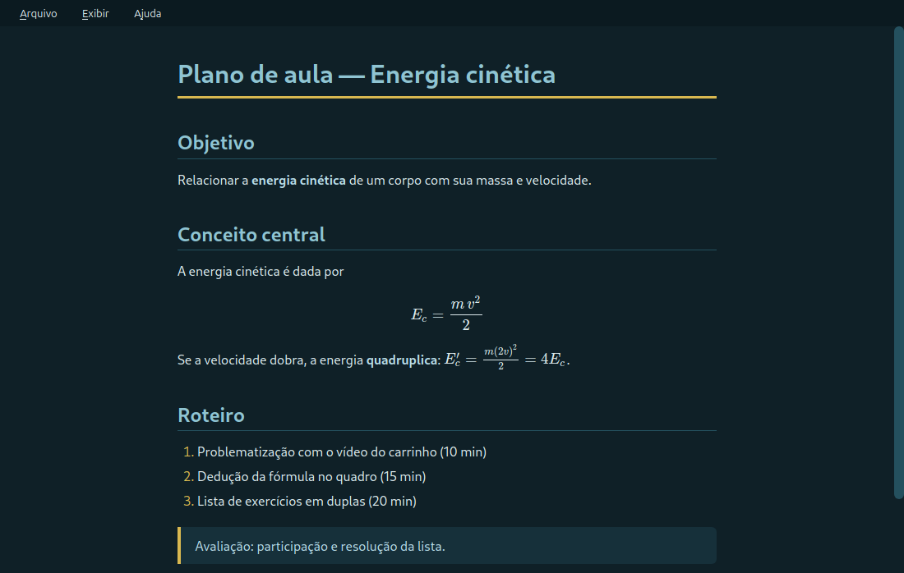

<p align="center">
  
</p>

<h1 align="center">SODMD</h1>

<p align="center">
  <b>Escreva seus planos de aula em texto simples, com equações de verdade.</b><br>
  Editor e leitor de Markdown com LaTeX, feito para professores.<br>
  Gratuito, funciona sem internet, no Windows, no Linux e no Android.
</p>

<p align="center">
  <a href="#-baixar"><b>⬇️ Baixar a versão 1.3</b></a> ·
  <a href="#-como-instalar">Como instalar</a> ·
  <a href="#-primeiros-passos">Primeiros passos</a> ·
  <a href="#-perguntas-frequentes">Dúvidas</a>
</p>



<p align="center"><i>À esquerda, o que você digita. À direita, o que você vê com <kbd>Ctrl</kbd>+<kbd>1</kbd>.</i></p>

---

## ⬇️ Baixar

| Seu aparelho | Arquivo | Tamanho |
|---|---|---|
| 🪟 **Windows** 10 ou 11 (64 bits) | [**SODMD-Setup-1.3.exe**](https://github.com/fredsobrito-maker/SODMD-download/releases/download/v1.3/SODMD-Setup-1.3.exe) | 78 MB |
| 🐧 **Linux** Mint, Ubuntu ou Debian | [**sodmd_1.3-1_all.deb**](https://github.com/fredsobrito-maker/SODMD-download/releases/download/v1.3/sodmd_1.3-1_all.deb) | 33 KB |
| 🤖 **Android** 7.0 ou mais novo | [**SODMD-1.2.apk**](https://github.com/fredsobrito-maker/SODMD-download/releases/download/v1.3/SODMD-1.2.apk) | 781 KB |

Clique no nome do arquivo e o download começa na hora. Versões anteriores e
a lista de novidades de cada uma estão em
[**Todas as versões**](https://github.com/fredsobrito-maker/SODMD-download/releases).

> O app Android segue na versão 1.2. A 1.3 trouxe novidades só para o computador.

## ✨ O que ele faz

- **Dois modos, um atalho.** <kbd>Ctrl</kbd>+<kbd>2</kbd> para escrever,
  <kbd>Ctrl</kbd>+<kbd>1</kbd> para ver o resultado formatado. <kbd>F9</kbd>
  alterna entre os dois.
- **Equações como nos livros.** Frações, raízes, vetores e somatórios em LaTeX,
  desenhados com a mesma qualidade de um material impresso.
- **Funciona sem internet.** Tudo roda no seu aparelho, sem conta, sem nuvem
  e sem propaganda.
- **Seus arquivos continuam seus.** Os documentos são arquivos `.md` comuns.
  Qualquer editor de texto abre, e eles cabem em e-mail, pen drive ou Google Drive.
- **Modo noturno** (<kbd>Ctrl</kbd>+<kbd>Shift</kbd>+<kbd>N</kbd>) para
  corrigir e planejar à noite sem cansar a vista.
- **Arquivos recentes** no menu Arquivo, para voltar ao plano de ontem com um clique.

<details>
<summary><b>Ver o modo noturno</b></summary>



</details>

## 🛠️ Como instalar

<details open>
<summary><b>🪟 Windows</b></summary>

1. Baixe o `SODMD-Setup-1.3.exe` e dê dois cliques nele.
2. Se aparecer a tela azul **"O Windows protegeu o computador"**, clique em
   **Mais informações** e depois em **Executar assim mesmo**. O aviso aparece
   porque o instalador não tem assinatura digital paga. Não é vírus.
3. Siga o assistente. **Não precisa de senha de administrador.**
4. Se quiser, marque a opção de abrir arquivos `.md` com o SODMD. Aí é só
   dar dois cliques em qualquer plano para ele abrir direto.

O SODMD aparece no menu Iniciar.
</details>

<details>
<summary><b>🐧 Linux (Mint, Ubuntu, Debian)</b></summary>

**Jeito fácil:** dê dois cliques no `.deb` baixado e clique em **Instalar pacote**.

**Pelo terminal:** abra o terminal na pasta Downloads e digite:

```bash
sudo apt install ./sodmd_1.3-1_all.deb
```

O próprio sistema baixa o que faltar. O SODMD aparece no menu de aplicativos,
na categoria Escritório.
</details>

<details>
<summary><b>🤖 Android</b></summary>

1. Abra o link do `.apk` **no próprio celular** e baixe o arquivo.
2. Toque na notificação de download concluído.
3. O Android vai pedir para **permitir a instalação de apps desta fonte**.
   Permita (só para o navegador que você usou) e volte.
4. Toque em **Instalar**.

No app, abra qualquer arquivo `.md` do celular. Você pode ler, marcar
caixinhas de tarefa e editar. As alterações ficam gravadas no próprio arquivo.

> **Chromebook da escola:** Chromebooks administrados pela instituição
> costumam bloquear a instalação de APKs. Isso é uma regra da escola e não
> tem como contornar pelo app.
</details>

## 🚀 Primeiros passos

Crie um arquivo novo (<kbd>Ctrl</kbd>+<kbd>N</kbd>), cole o texto abaixo e
aperte <kbd>Ctrl</kbd>+<kbd>1</kbd>:

```markdown
# Plano de aula — Energia cinética

## Objetivo

Relacionar a **energia cinética** com a massa e a velocidade.

$$E_c = \frac{m\,v^2}{2}$$

## Roteiro

1. Problematização (10 min)
2. Dedução no quadro (15 min)
3. Exercícios em duplas (20 min)
```

Pronto: você já sabe 90% do que precisa. O resto está na colinha abaixo.

<details>
<summary><b>📝 Colinha de Markdown e LaTeX</b></summary>

| Você digita | Você vê |
|---|---|
| `# Título` | Título grande |
| `## Seção` | Título de seção |
| `**negrito**` | **negrito** |
| `*itálico*` | *itálico* |
| `- item` | Lista com marcadores |
| `1. item` | Lista numerada |
| `- [ ] tarefa` | Caixinha de tarefa clicável (no Android) |
| `> observação` | Destaque (citação) |
| `$x^2$` | Equação no meio do texto |
| `$$ ... $$` | Equação centralizada, em linha própria |
| `\frac{a}{b}` | Fração a/b |
| `\sqrt{x}` | Raiz quadrada |
| `\vec{F}` | Vetor F |
| `\Delta t` | Delta t |
| `x_1` e `x^2` | Índice e expoente |

Tabelas também funcionam:

```markdown
| Turma | Aulas |
|-------|-------|
| 1º A  | 3     |
```
</details>

<details>
<summary><b>⌨️ Todos os atalhos (computador)</b></summary>

| Atalho | Ação |
|---|---|
| <kbd>Ctrl</kbd>+<kbd>1</kbd> | Modo leitura |
| <kbd>Ctrl</kbd>+<kbd>2</kbd> | Modo edição |
| <kbd>F9</kbd> | Alterna entre leitura e edição |
| <kbd>Ctrl</kbd>+<kbd>N</kbd> | Novo arquivo |
| <kbd>Ctrl</kbd>+<kbd>O</kbd> | Abrir |
| <kbd>Ctrl</kbd>+<kbd>S</kbd> | Salvar |
| <kbd>Ctrl</kbd>+<kbd>Shift</kbd>+<kbd>S</kbd> | Salvar como |
| <kbd>Ctrl</kbd>+<kbd>Shift</kbd>+<kbd>N</kbd> | Modo noturno |
| <kbd>F11</kbd> | Tela cheia |
</details>

## ❓ Perguntas frequentes

<details>
<summary><b>O que é Markdown? Preciso saber programar?</b></summary>

Não precisa. Markdown é só um jeito de escrever texto com alguns símbolos
simples: `#` para título, `**` para negrito, `-` para lista. Você aprende em
cinco minutos com a colinha acima. A vantagem é que o arquivo continua sendo
texto puro: leve, fácil de copiar e legível mesmo sem o SODMD.
</details>

<details>
<summary><b>E o LaTeX?</b></summary>

É a linguagem que matemáticos e cientistas usam para escrever fórmulas. No
SODMD, basta colocar a fórmula entre cifrões: `$E = mc^2$`. Se você já usou
o editor de equações do Word ou do Google Docs, vai reconhecer muita coisa.
</details>

<details>
<summary><b>Consigo abrir no computador um arquivo que escrevi no celular?</b></summary>

Consegue. O arquivo é o mesmo `.md` nos dois. Passe por Google Drive, e-mail,
cabo USB ou pen drive, como preferir.
</details>

<details>
<summary><b>Como atualizo para uma versão nova?</b></summary>

Baixe o arquivo novo nesta página e instale por cima. Seus documentos não são
afetados, porque ficam nas suas pastas e não dentro do app.
</details>

<details>
<summary><b>É seguro? Por que o Windows e o Android reclamam?</b></summary>

Os dois sistemas avisam sempre que um programa não vem de uma loja oficial ou
não tem uma assinatura digital paga. O SODMD não acessa a internet, não coleta
dados e só abre e salva os arquivos que você escolher. No Android, ele não pede
nenhuma permissão especial.
</details>

## 💬 Encontrou um problema?

Abra um aviso em [**Issues**](https://github.com/fredsobrito-maker/SODMD-download/issues/new)
contando o que aconteceu, em qual aparelho e, se puder, com uma captura de tela.

---

<p align="center">
  <sub>O SODMD faz parte do <b>Sistema Operacional Docente (SOD)</b>, um conjunto de ferramentas para o planejamento de professores.</sub>
</p>
